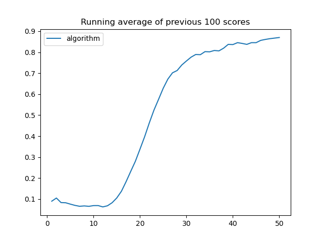

# HindsightExperienceReplay
Implementation HindSight Experience Replay algorithm with DDPG and Soft Actor Critic Algorithm and testing it on pybullet gym environments.

[HindSightExperience replay paper](https://arxiv.org/pdf/1707.01495.pdf).

There are implementation of DQN and testing it with HER on BitFlipEnvironment. 

Also there is implementation of [DDPG](https://spinningup.openai.com/en/latest/algorithms/ddpg.html) and [SoftActorCritic](https://arxiv.org/pdf/1801.01290.pdf) Algorithms which are tested on [FetchPush-v2](https://robotics.farama.org/envs/fetch/push/) environment from [gymnasium-robotics](https://robotics.farama.org/content/installation/).

All notebooks with experiments are in directory **experiments**
All based RL algoritms (DQN, SAC, DDPG) are in directory **models**